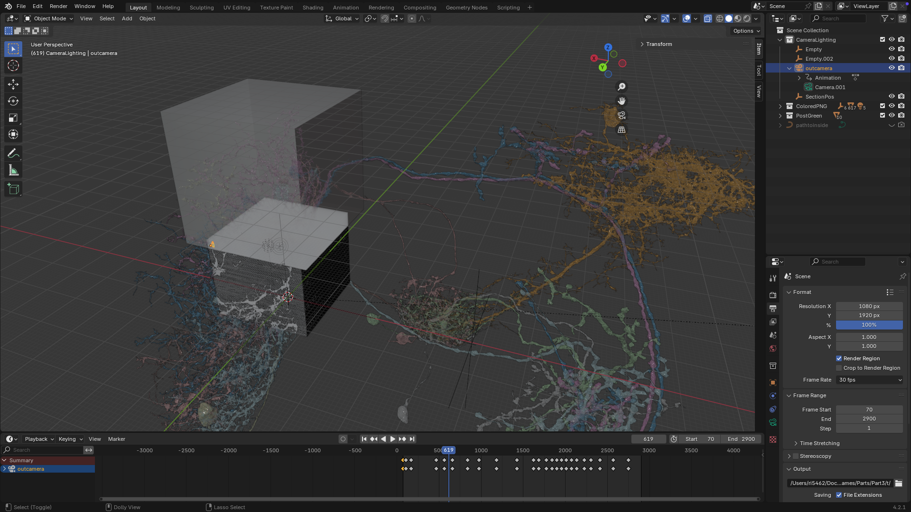

#   NeuroBlender: Using Blender for Neuroscience  

This notebook contains the code to import neuron meshes, segmentation images, and EM images into **Blender**. It also provides a concise guide on how to scale images and meshes to the correct size for rendering. This serves as a **starter guide** for using Blender to create animations and renders of neurons.  




This code utilizes **CloudVolume** and **MeshParty** to retrieve both images and meshes.  

## Covered Topics  
✔ Acquiring the neuron meshes  
✔ Acquiring the segmentation images  
✔ Acquiring the EM images  
✔ Scaling the images to the correct size  
✔ Coloring the neurons appropriately  
✔ Importing the meshes into Blender  
✔ Importing the images into Blender  
✔ Rendering neuron animations  

## Prerequisites  

Ensure you have the following dependencies installed:  

- **Blender** (Version used: **4.2.1** on macOS)  
- **Python** (Version used: **3.10.16**)  
- **CloudVolume** (Version used: **11.2.0**)  
- **MeshParty** (Version used: **1.18.2**)  
- **Open3D** (Version used: **0.19.0**)  
- **Matplotlib** (Version used: **3.10.1**)  
- **CaveClient** (Optional, for interacting with Connectome Analysis Vault)  

### Installation Instructions  

#### Using Conda:  
```bash
conda create -n blender_env python=3.10
conda activate blender_env
conda install -c conda-forge open3d numpy matplotlib
pip install cloud-volume meshparty caveclient
```

#### Using Virtualenv:  
```bash
python -m venv blender_env
source blender_env/bin/activate


Everything is self-contained in the .ipynb file and you can access the functions' code in source_functions.py. 
Contact me at levisseraphael0@gmail.com for any questions or suggestions. Thanks to the Seung Lab for the data, Sven Dorkenwald and the CaveClient team for meshparty, William Silversmith for his efficient cloudvolume library. And of course, Pr. Sebastian Seung for motivating this project.


Happy rendering!